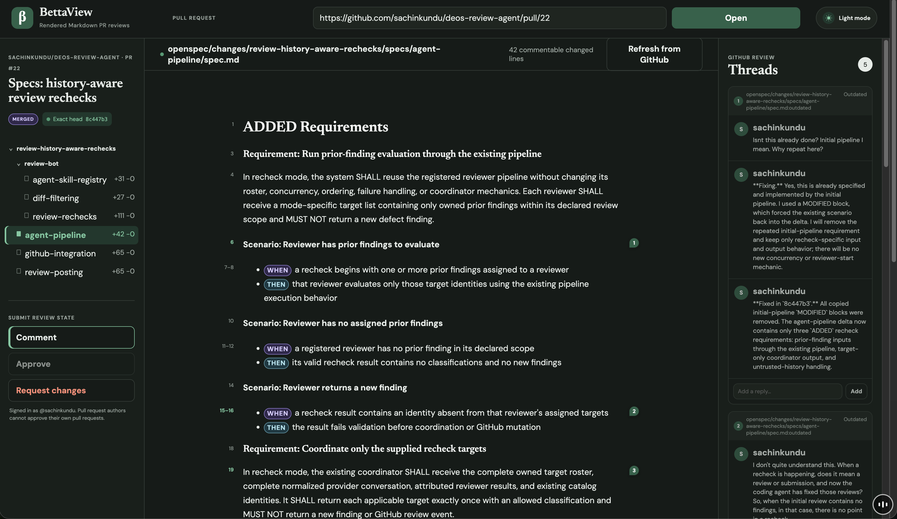
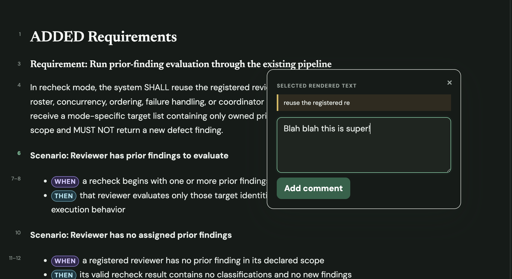

# BettaView

BettaView is a Phase 1 experiment for reviewing GitHub pull request Markdown in
rendered form while keeping comments and review state native to GitHub.

The experiment plan is in [`implementation-plan.md`](implementation-plan.md).
Phase 2 OpenSpec traceability is deliberately separate and has not started.

## See BettaView

Review rendered Markdown beside its GitHub threads and move between changed
documents from the file tree.



Select text in the rendered document and add a comment without leaving the
page.



## Run the experiment portal

Prerequisites: Node.js 22 or newer and an authenticated GitHub CLI session with
access to the pull request repository.

```sh
npm install
npm run build
npm start
```

Open <http://127.0.0.1:4174>. The portal remembers the most recently viewed
pull request and restores it while it remains available on GitHub. Open,
merged, and closed pull requests can all be viewed.

- Select unique text in rendered Markdown to open a comment box beside the
  selection.
- Draw arrows or circles over rendered Mermaid diagrams, with undo and redo,
  then add typed comments for the annotations.
- Keep new comments and replies in the local review queue. The publish control
  appears with the first draft and sends the queue in one review submission.
- Use the numbered markers at each rendered comment position to reveal and
  highlight the matching card in the thread column. Threads without BettaView
  selection metadata fall back to their native GitHub line.
- Use the rendered line-number gutter or a thread's file-and-line link to move
  back from the discussion to the document.
- See only the published threads and unpublished comments for the Markdown file
  currently open in the document view.
- Refresh to reconstruct published threads and annotation metadata from GitHub.
  BettaView warns before a refresh or navigation would discard local drafts.

The experiment server binds only to loopback. It reads the token returned by
`gh auth token` in the server process and never sends the token to the browser.
Annotation PNGs are committed to the `bettaview-annotations` branch and linked
from native review comments. No application database or asset store is used.

## Experiment shortcut

This one-shot implementation uses the local GitHub CLI identity instead of a
GitHub App. It is intended only for the dedicated, non-sensitive public fixture
repository. A production implementation would require GitHub App installation
authentication, authorization boundaries, and broader security work.
