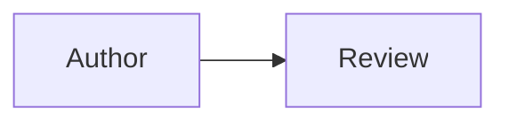

# Rendered review fixture

This baseline document exists so the experiment pull request can exercise
native GitHub review anchors against changed Markdown prose and Mermaid source.

```mermaid
flowchart LR
    Author --> Review
```

